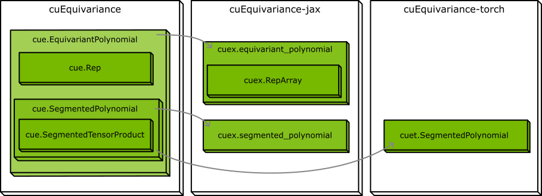
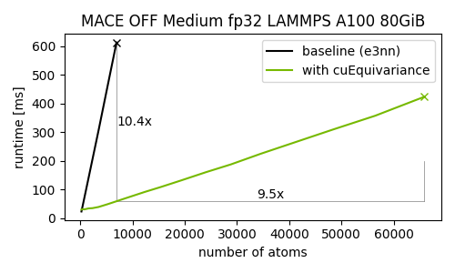

.. SPDX-FileCopyrightText: Copyright (c) 2024-2026 NVIDIA CORPORATION & AFFILIATES. All rights reserved.
   SPDX-License-Identifier: Apache-2.0

   Licensed under the Apache License, Version 2.0 (the "License");
   you may not use this file except in compliance with the License.
   You may obtain a copy of the License at

   http://www.apache.org/licenses/LICENSE-2.0

   Unless required by applicable law or agreed to in writing, software
   distributed under the License is distributed on an "AS IS" BASIS,
   WITHOUT WARRANTIES OR CONDITIONS OF ANY KIND, either express or implied.
   See the License for the specific language governing permissions and
   limitations under the License.

NVIDIA cuEquivariance Documentation
===================================

cuEquivariance is an NVIDIA Python library of GPU-accelerated building blocks for
geometric deep learning. It covers two areas: **equivariant tensor products** for
models that respect the symmetries of three-dimensional space, and **triangle
operations** for the pair-representation blocks of biomolecular structure
prediction. The tensor products, the triangle multiplicative update and triangle
attention have PyTorch and JAX frontends; attention with pair bias is PyTorch only.
All of them share one set of prebuilt CUDA kernel wheels.

.. grid:: 1 1 2 2
   :gutter: 3

   .. grid-item-card:: Equivariant tensor products
      :link: equivariant-tensor-products
      :link-type: ref

      A descriptor API for segmented polynomials and segmented tensor products,
      with CUDA kernels that execute them. The operations behind equivariant
      interatomic potentials such as MACE, NequIP and Allegro.

      * Irreps, layouts and group representations
      * Segmented tensor products and polynomials
      * Linear, channel-wise and fully connected tensor product layers,
        symmetric contraction, spherical harmonics

      +++
      Describe the polynomial once, execute it in PyTorch or JAX.

   .. grid-item-card:: Triangle operations
      :link: triangle-operations
      :link-type: ref

      Fused kernels for the pair-representation blocks of structure prediction
      models such as AlphaFold 3.

      * Triangle multiplicative update
      * Triangle attention
      * Attention with pair bias (PyTorch only)

      +++
      Drop-in replacements for the reference blocks.

The frontends are open source under the Apache 2.0 license on `GitHub
<https://github.com/NVIDIA/cuEquivariance>`_. The CUDA kernels ship as prebuilt
``cuequivariance-ops-*`` wheels for CUDA 12 and CUDA 13.

What's new in 0.14
------------------

Released 2026-11-25. Highlights:

* **Triangle multiplicative update kernels for ranges of shapes.** In 0.13, the
  optimized PyTorch inference kernels ran only on a fixed list of exact shapes. In
  0.14, each pair/hidden width class has a kernel that covers a continuous range of
  batch sizes and sequence lengths: about 80,000 batch/length combinations per GPU,
  instead of about 100 fixed shapes. Every shape that was optimized in 0.13 is still
  optimized. Width classes 128/128, 256/256, 384/256, 384/384 and 512/512, with and
  without projection bias. The kernels ship prebuilt in the CUDA 13 wheels.
* **New GPUs for the optimized triangle multiplicative update:** B300 SXM, GB300
  and Vera Rubin.
* **Triangle attention on Vera Rubin:** new optimized forward kernels for PyTorch
  and JAX (BF16, head dimension 16, 32, 64 or 128).
* **Triangle attention on RTX PRO 6000 Blackwell:** faster forward kernels for head
  dimensions 16 to 128.
* **Fix:** triangle attention on inputs with more than 2\ :sup:`31` elements no
  longer gives wrong results or fails with an illegal memory access.
* From 0.13: optimized triangle multiplicative update training kernels on H100 SXM,
  H200, GH200 and B200, and ``mask=None`` in ``cuex.triangle_attention``.

The full list of changes, the exact supported shapes and the known issues are in
the :doc:`changelog` and the `GitHub release notes
<https://github.com/NVIDIA/cuEquivariance/releases>`_.

Installation
------------

Install from `PyPI <https://pypi.org/>`_ with pip. Pick one frontend and the kernel
wheel that matches your CUDA version. The ``-cu13`` wheels contain kernels that the
``-cu12`` wheels do not; use ``-cu13`` when your driver allows it.

.. tab-set::

   .. tab-item:: PyTorch

      .. code-block:: bash

         pip install cuequivariance-torch cuequivariance-ops-torch-cu13   # or -cu12

   .. tab-item:: JAX

      .. code-block:: bash

         pip install cuequivariance-jax cuequivariance-ops-jax-cu13       # or -cu12

   .. tab-item:: Core only

      .. code-block:: bash

         # Descriptors and NumPy execution, no GPU kernels
         pip install cuequivariance

**Requirements.** Linux x86_64 or aarch64 for the ``cuequivariance-ops-*`` wheels.
Python 3.10 to 3.14. PyTorch 2.11 to 2.14 for the ``cuequivariance-ops-torch-cu13``
wheels, and 2.11 to 2.13 for ``-cu12``. JAX 0.9.1 or newer for ``cuequivariance-jax``.
On B300, GB300 and Vera Rubin, use the ``-cu13`` wheels.

Supported operations and hardware
---------------------------------

Every operation has a generic implementation that runs on any supported NVIDIA GPU.
The table lists where an operation also has a specialized kernel in 0.14.0. Details
per shape and data type are in the :doc:`changelog`.

.. list-table::
   :header-rows: 1
   :widths: 24 12 32 32

   * - Operation
     - Frontends
     - Specialized kernels
     - Notes
   * - Segmented tensor products and polynomials
     - PyTorch, JAX
     - All supported GPUs: descriptor-driven CUDA kernels, including the fused
       tensor product and the uniform 1d kernels.
     - Kernel methods ``uniform_1d``, ``fused_tp`` (PyTorch only) and ``indexed_linear``, with
       the math precision selectable through ``math_dtype`` (FP32 or FP64).
       NumPy execution in the core package.
   * - Tensor product layers
     - PyTorch, JAX
     - Built on the kernels above: linear, channel-wise and fully connected tensor
       products, symmetric contraction, spherical harmonics, layout transposes.
     - PyTorch ``nn.Module`` classes; JAX functions and Flax NNX layers.
   * - Triangle multiplicative update
     - PyTorch, JAX
     - PyTorch inference on H100 SXM, H200, GH200 480GB, B200, B300 SXM, GB300 and
       RTX PRO 6000 Blackwell (Server and Workstation Edition): pair/hidden widths
       128/128, 256/256, 384/256, 384/384 and 512/512, for ranges of batch size
       (up to 32) and sequence length (from 128). Vera Rubin: 128/128, 256/256,
       384/256 and 512/512. Training on H100 SXM, H200, GH200 and B200 at listed
       shapes.
     - BF16 pair representation and BF16 parameters. CUDA 13 wheels. Other shapes,
       other GPUs, the CUDA 12 wheels and JAX use the 0.12 implementation.
   * - Triangle attention
     - PyTorch, JAX
     - Native kernels on B200 / B300 (SM100f), RTX PRO 6000 Blackwell (sm120f) and
       Vera Rubin (forward, BF16, head dimension 16 to 128); generic kernel on H100,
       H200, A100, L40.
     - BF16, FP16; FP32/TF32 for small head dimensions. ``kv_lengths`` (PyTorch)
       selects the right-padded fast path on Blackwell; JAX selects it from the
       mask. Forward and backward.
   * - Attention pair bias
     - PyTorch
     - Inference on H100, H200, B200, B300, RTX PRO 6000 Blackwell, A100; training
       on H100, H200, B200, B300.
     - LayerNorm or RMSNorm. Pair widths 128 and 256 (384 on specific RMSNorm
       routes); 4 to 16 heads; head dimension 8 to 64.

Triangle multiplicative update: supported ranges
~~~~~~~~~~~~~~~~~~~~~~~~~~~~~~~~~~~~~~~~~~~~~~~~

In 0.14, the optimized TriMul inference kernels cover continuous ranges of batch size B
and sequence length N, not a fixed list of shapes. Each cell gives the range of N that
is covered for every B in that column, with and without projection bias, in the incoming
and outgoing directions. The largest N is the largest value with B × N² × D below
2\ :sup:`30`; smaller batch sizes inside a column can use slightly longer sequences.
Shapes outside the ranges, including B above 32, use the 0.12 implementation.

.. dropdown:: H100 SXM, H200, GH200 480GB

   .. list-table::
      :header-rows: 1

      * - C / D
        - B = 1
        - B = 2
        - B = 3–4
        - B = 5–8
        - B = 9–16
        - B = 17–32
      * - 128 / 128
        - 128–2896
        - 128–2047
        - 128–1448
        - 128–1023
        - 128–724
        - 128–511
      * - 256 / 256
        - 128–2047
        - 128–1448
        - 128–1023
        - 128–724
        - 128–511
        - 128–362
      * - 384 / 256
        - 128–2047
        - 128–1448
        - 128–1023
        - 128–724
        - 128–512
        - 128–362
      * - 384 / 384
        - 128–1672
        - 128–1182
        - 128–836
        - 128–591
        - 128–418
        - 128–295
      * - 512 / 512
        - 128–1448
        - 128–1023
        - 128–724
        - 128–511
        - 128–362
        - 128–255

.. dropdown:: B200

   .. list-table::
      :header-rows: 1

      * - C / D
        - B = 1
        - B = 2
        - B = 3–4
        - B = 5–8
        - B = 9–16
        - B = 17–32
      * - 128 / 128
        - 32–2896
        - 32–2047
        - 32–1448
        - 128–1023
        - 128–724
        - 128–511
      * - 256 / 256
        - 32–2047
        - 32–1448
        - 32–1023
        - 128–724
        - 128–511
        - 128–362
      * - 384 / 256
        - 32–2047
        - 32–1448
        - 32–1024
        - 128–724
        - 128–512
        - 128–362
      * - 384 / 384
        - 128–1672
        - 128–1182
        - 128–836
        - 128–591
        - 128–418
        - 128–295
      * - 512 / 512
        - 32–1448
        - 32–1023
        - 32–724
        - 128–512
        - 128–362
        - 128–255

.. dropdown:: B300 SXM, GB300

   .. list-table::
      :header-rows: 1

      * - C / D
        - B = 1
        - B = 2
        - B = 3–4
        - B = 5–8
        - B = 9–16
        - B = 17–32
      * - 128 / 128
        - 128–2896
        - 128–2047
        - 128–1448
        - 128–1023
        - 128–724
        - 128–511
      * - 256 / 256
        - 128–2047
        - 128–1448
        - 128–1023
        - 128–724
        - 128–511
        - 128–362
      * - 384 / 256
        - 128–2047
        - 128–1448
        - 128–1023
        - 128–724
        - 128–511
        - 128–362
      * - 384 / 384
        - 128–1672
        - 128–1182
        - 128–836
        - 128–591
        - 128–418
        - 128–295
      * - 512 / 512
        - 128–1448
        - 128–1023
        - 128–724
        - 128–511
        - 128–362
        - 128–255

.. dropdown:: RTX PRO 6000 Blackwell (Server and Workstation Edition)

   .. list-table::
      :header-rows: 1

      * - C / D
        - B = 1
        - B = 2
        - B = 3–4
        - B = 5–8
        - B = 9–16
        - B = 17–32
      * - 128 / 128
        - 128–2896
        - 128–2047
        - 128–1448
        - 128–1023
        - 128–724
        - 128–511
      * - 256 / 256
        - 128–2047
        - 128–1448
        - 128–1023
        - 128–724
        - 128–511
        - 128–362
      * - 384 / 256
        - 128–2047
        - 128–1448
        - 128–1023
        - 128–724
        - 128–511
        - 128–362
      * - 384 / 384
        - 128–1672
        - 128–1182
        - 128–836
        - 128–591
        - 128–418
        - 128–295
      * - 512 / 512
        - 128–1448
        - 128–1023
        - 128–724
        - 128–511
        - 128–362
        - 128–255

.. dropdown:: Vera Rubin

   .. list-table::
      :header-rows: 1

      * - C / D
        - Sequence lengths N at B = 1
      * - 128 / 128
        - 32–15,231
      * - 256 / 256
        - 32–10,776
      * - 384 / 256
        - 32–9,843
      * - 512 / 512
        - 32–7,624 (7,615 if N is not a multiple of 8)

   384/384 is not optimized on Vera Rubin. There is no fixed upper limit on the sequence
   length: GPU memory sets the largest N, and the table gives the largest N that ran on
   a VR200 at B = 1. With larger batch sizes, the largest N decreases approximately as
   1/√B.

Getting started
---------------

.. grid:: 1 1 2 2
   :gutter: 3

   .. grid-item-card:: Tensor products in PyTorch
      :link: tutorials/pytorch/index
      :link-type: doc

      :class:`cuet.SegmentedPolynomial <cuequivariance_torch.SegmentedPolynomial>`
      and the layer modules, with a complete :doc:`MACE model <tutorials/pytorch/MACE>`.

   .. grid-item-card:: Tensor products in JAX
      :link: tutorials/jax/index
      :link-type: doc

      :func:`cuex.equivariant_polynomial <cuequivariance_jax.equivariant_polynomial>`,
      :func:`cuex.segmented_polynomial <cuequivariance_jax.segmented_polynomial>` and
      the dictionary-based :doc:`feature interface <tutorials/jax/ir_dict>`.

   .. grid-item-card:: Triangle operations in PyTorch
      :link: api/cuequivariance_torch
      :link-type: doc

      :func:`cuet.triangle_multiplicative_update <cuequivariance_torch.triangle_multiplicative_update>`,
      :func:`cuet.triangle_attention <cuequivariance_torch.triangle_attention>` and
      :func:`cuet.attention_pair_bias <cuequivariance_torch.attention_pair_bias>`.

   .. grid-item-card:: Triangle operations in JAX
      :link: api/cuequivariance_jax
      :link-type: doc

      :func:`cuex.triangle_multiplicative_update <cuequivariance_jax.triangle_multiplicative_update>` and
      :func:`cuex.triangle_attention <cuequivariance_jax.triangle_attention>`.

.. _equivariant-tensor-products:

Equivariant tensor products
---------------------------

Equivariance is the mathematical formalization of "respecting symmetries". Models
that are equivariant to rotations and translations in three-dimensional space are
often more data-efficient. An introduction to group representations is on the page
:doc:`tutorials/irreps`.

cuEquivariance splits this area into three packages. The core package describes the
mathematics; the two frontends execute it.

.. jupyter-execute::

   import cuequivariance as cue
   # Group representations, descriptors and NumPy execution

   import cuequivariance_jax as cuex
   # JAX execution and Flax NNX layers

   import cuequivariance_torch as cuet
   # PyTorch operations and layers

A tensor product is a hierarchy of descriptors:

* :class:`cue.EquivariantPolynomial <cuequivariance.EquivariantPolynomial>` holds
  the :class:`cue.Rep <cuequivariance.Rep>` of each input and of the output.
* :class:`cue.SegmentedPolynomial <cuequivariance.SegmentedPolynomial>` is the
  polynomial inside it, made of one or several tensor products.
* :class:`cue.SegmentedTensorProduct <cuequivariance.SegmentedTensorProduct>`
  defines one tensor product.

The same descriptor is executed with :class:`cuet.SegmentedPolynomial
<cuequivariance_torch.SegmentedPolynomial>` in PyTorch, or with
:func:`cuex.equivariant_polynomial <cuequivariance_jax.equivariant_polynomial>` and
:func:`cuex.segmented_polynomial <cuequivariance_jax.segmented_polynomial>` in JAX.
The tutorials :doc:`tutorials/stp` and :doc:`tutorials/poly` build descriptors step
by step.

On a MACE model, cuEquivariance trains and runs faster than `e3nn
<https://github.com/e3nn/e3nn>`_ and reaches larger systems before running out of
memory. Crosses mark the largest number of atoms that fit on one device.

.. _triangle-operations:

Triangle operations
-------------------

Structure prediction models keep a pair representation, a tensor with one row per
pair of residues or atoms, and update it with three kinds of blocks. cuEquivariance
provides each one as a single fused call with the same inputs and outputs as the
reference PyTorch or JAX implementation:

* **Triangle multiplicative update**
  (:func:`cuet.triangle_multiplicative_update <cuequivariance_torch.triangle_multiplicative_update>`,
  :func:`cuex.triangle_multiplicative_update <cuequivariance_jax.triangle_multiplicative_update>`):
  input LayerNorm, gated projections, the outgoing or incoming triangle
  contraction, output LayerNorm and gate.
* **Triangle attention**
  (:func:`cuet.triangle_attention <cuequivariance_torch.triangle_attention>`,
  :func:`cuex.triangle_attention <cuequivariance_jax.triangle_attention>`): attention
  along the rows of the pair representation with a per-head bias and a Boolean mask
  or, in PyTorch, right-padded ``kv_lengths``.
* **Attention pair bias**
  (:func:`cuet.attention_pair_bias <cuequivariance_torch.attention_pair_bias>`):
  attention over the single representation biased by a projection of the pair
  representation, with LayerNorm or RMSNorm, as in the AlphaFold 3 diffusion
  module.

Forward and backward are supported, so the operations serve inference and
training. The recommended way to run them is ``torch.compile(model,
mode="reduce-overhead")`` after a few warm-up iterations; under compile, the
kernel selection costs nothing per call. With varying sequence lengths, one
compiled graph serves a whole range of lengths; with CUDA graphs, pad the lengths to
a small set of sizes. Calls on shapes or GPUs without a specialized kernel run the
generic implementation. The supported shapes, precision
rules, switches and known issues for each release are listed in the
:doc:`changelog`.

Agent skills
------------

The repository ships three agent skills that teach coding assistants how to use
each package: `cuequivariance
<https://github.com/NVIDIA/cuEquivariance/blob/main/skills/cuequivariance/SKILL.md>`_,
`cuequivariance-jax
<https://github.com/NVIDIA/cuEquivariance/blob/main/skills/cuequivariance-jax/SKILL.md>`_
and `cuequivariance-torch
<https://github.com/NVIDIA/cuEquivariance/blob/main/skills/cuequivariance-torch/SKILL.md>`_.
Installed packages expose the same text through ``python -m cuequivariance skill``,
``python -m cuequivariance_jax skill`` and ``python -m cuequivariance_torch skill``.

Tutorials
---------

| :doc:`tutorials/irreps`
| :doc:`tutorials/layout`
| :doc:`tutorials/stp`
| :doc:`tutorials/poly`
| :doc:`tutorials/pytorch/index`
| :doc:`tutorials/jax/index`

.. toctree::
   :hidden:

   tutorials/index

API Reference
-------------

.. toctree::
   :maxdepth: 1

   api/cuequivariance
   api/cuequivariance_jax
   api/cuequivariance_torch

Release Notes
-------------

.. toctree::
   :maxdepth: 2

   changelog

Status
------

cuEquivariance is in a Beta state. Beta products may not be fully functional, may
contain errors or design flaws, and may be changed at any time without notice.
Please report issues and feedback on `GitHub
<https://github.com/NVIDIA/cuEquivariance/issues>`_.
