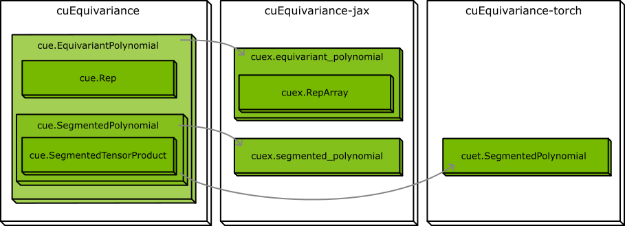

.. SPDX-FileCopyrightText: Copyright (c) 2024 NVIDIA CORPORATION & AFFILIATES
   SPDX-License-Identifier: Apache-2.0

NVIDIA cuEquivariance Documentation
===================================

cuEquivariance is a Python library designed to facilitate the construction of high-performance equivariant neural networks using segmented tensor products. cuEquivariance provides a comprehensive API for describing segmented tensor products and optimized CUDA kernels for their execution. Additionally, cuEquivariance offers bindings for both PyTorch and JAX, ensuring broad compatibility and ease of integration.

Equivariance is the mathematical formalization of the concept of "respecting symmetries." Robust physical models exhibit equivariance with respect to rotations and translations in three-dimensional space. Artificial intelligence models that incorporate equivariance are often more data-efficient.

Installation
------------

The easiest way to install cuEquivariance is from `PyPi <https://pypi.org/>`_ using `pip <https://pip.pypa.io/en/stable/>`_.

.. code-block:: bash

   # Choose the frontend you want to use
   pip install cuequivariance-jax
   pip install cuequivariance-torch
   pip install cuequivariance  # Installs only the core non-ML components

   # CUDA kernels for different CUDA versions
   pip install cuequivariance-ops-torch-cu11
   pip install cuequivariance-ops-torch-cu12

Supported platforms
-------------------

``cuequivariance-ops-torch-*`` packages are only available for Linux x86_64.

Organization
------------

Most tensor products are defined using the :class:`~cuequivariance.EquivariantTensorProduct` class, which encapsulates the :class:`~cuequivariance.Irreps` and :class:`~cuequivariance.IrrepsLayout` for each input and the output. It also includes one or more instances of :class:`~cuequivariance.SegmentedTensorProduct`, which define the tensor product operations.
This descriptor is then used to create a :class:`~cuequivariance_torch.EquivariantTensorProduct` module, which can be used in PyTorch models. Or used to execute the tensor product operations using :class:`~cuequivariance_jax.equivariant_tensor_product` in JAX.

.. toctree::
   :maxdepth: 1
   :caption: Tutorials

   tutorials/irreps
   tutorials/layout
   tutorials/etp
   tutorials/stp

.. toctree::
   :maxdepth: 1
   :caption: API Reference

   api/cuequivariance
   api/cuequivariance_jax
   api/cuequivariance_torch

.. toctree::
   :maxdepth: 1
   :caption: Change Log

   changelog
